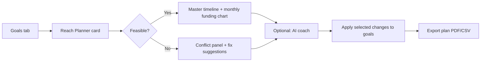
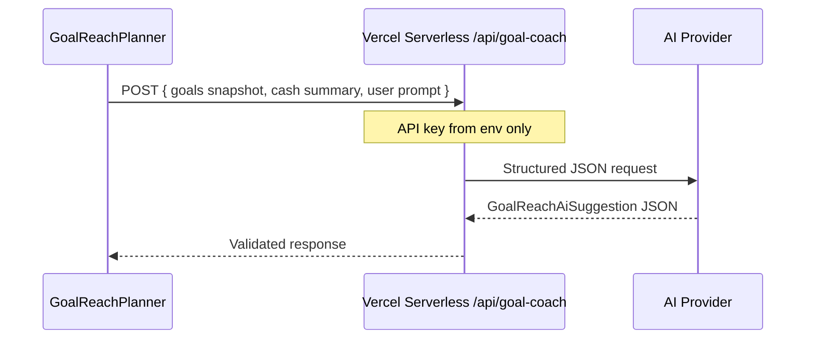

# Goal Reach Planner — Design Document

**Date**: 2026-06-17  
**Status**: Draft for review  
**Author**: Cash Flow CFO product design  
**Audience**: You (solo user / CEO) + future implementers

---

## 1. Executive summary

You have **11 active goals**, each with deadlines, budgets, tasks, milestones, and constraints — but the app today shows goals **one at a time** and does not answer the meta-question:

> *Can I actually reach all 11 on time, with my current savings and cash flow — and if not, what should change first?*

**Goal Reach Planner** is a new Goals-tab experience that:

1. **Loads all 11 goals** into a single **master timeline** (deadlines + milestones + task costs).
2. **Scores feasibility** against savings balance, monthly net flow, and 20-year fin goal (if set).
3. **Proposes a sequenced plan** (what to fund this month / quarter / year) using deterministic math first.
4. **Optionally calls an AI coach** to explain trade-offs, rewrite milestones, and suggest weekly focus — via a small serverless proxy (API key never in the browser).

This document covers product logic, UI wireframes, data model extensions, AI provider choices, and a phased PR plan.

---

## 2. Problem statement

### 2.1 What you have today

| Capability | Location | Gap |
|------------|----------|-----|
| Per-goal tasks, milestones, budget | `GoalList`, `GoalMilestoneSection` | No cross-goal view |
| Savings vs allocated budgets | `GoalBudgetAllocator` | One number, no timeline |
| Countdown to next milestone | `GoalTimerBadge` / `goalTimer.ts` | Per goal only |
| Cash projection | `CashFlowSimulator` | Not tied to goal deadlines |
| 20-year fin goal | `LongTermFinGoalCard` | Separate from tactical goals |
| Print / CSV export | `printReport`, `csvExport` | No “plan” artifact |

### 2.2 Failure modes with 11 goals

- **Deadline pile-up**: multiple goals due same quarter → cash crunch.
- **Over-allocation**: sum of `goal.budget` > `latestSavingsBalance` (already warned in allocator).
- **Hidden task cost**: task `cost` exceeds goal `budget` silently.
- **Time debt**: `timeCost` strings not aggregated → calendar overload.
- **Priority blur**: no ranked “do this week” across goals.

---

## 3. Product vision

### 3.1 North-star outcome

A single screen answers:

1. **When** each of the 11 goals can realistically complete (earliest / planned / latest).
2. **How much** to save or spend per month toward each.
3. **What breaks** if you miss a month of income or add a new goal.
4. **What to do this week** (top 3 actions across all goals).

### 3.2 Design principles

- **Deterministic first, AI second** — plan must work offline with zero API cost.
- **User stays in control** — AI suggests; you accept/reject per goal.
- **Reuse store data** — no duplicate goal entry.
- **Locale-aware** — same i18n pattern as print/CSV (en / zh-TW / ja).
- **Privacy** — goal titles & amounts only sent to AI when you explicitly click “Get AI suggestions.”

---

## 4. User journey (high level)



---

## 5. UI design

### 5.1 Placement

Add **“Reach Planner”** as a sub-view inside the existing **Goals** tab (not a new top-level tab), above `GoalBudgetAllocator`:

```
Goals tab
├── [Reach Planner]  ← NEW (collapsible card or segmented control: List | Planner)
├── Goal Budget Allocator (existing)
└── Goal List (existing)
```

Segmented control: **`List`** | **`Planner`** — default `List` for power users; `Planner` for planning sessions.

### 5.2 Screen A — Reach Planner overview

```
┌─────────────────────────────────────────────────────────────────┐
│  Reach Planner                    [Refresh] [Export] [AI Coach ▾] │
├─────────────────────────────────────────────────────────────────┤
│  Feasibility   ████████░░  78%     11 goals · 4 at risk         │
│  Savings gap   −$12,400 by Q3 2026   (if plan unchanged)        │
│  This week     ● Finish pre-task X  ● Milestone Y  ● Save $800   │
├─────────────────────────────────────────────────────────────────┤
│  MASTER TIMELINE (2026 ───────────────────────────────► 2028)   │
│  Goal 1  ████████░░░░░░░░  deadline ▲                           │
│  Goal 2      ██████████░░  milestone ◆                          │
│  Goal 3  ░░░░████████████  (sequenced after #2)                 │
│  ...                                                            │
│  Legend: ▲ deadline  ◆ milestone  █ funded window  ░ gap        │
├─────────────────────────────────────────────────────────────────┤
│  Monthly funding (next 12 mo)                                     │
│  [stacked bar chart: goal slices vs available surplus]          │
└─────────────────────────────────────────────────────────────────┘
```

**Components (new)**

| Component | Responsibility |
|-----------|----------------|
| `GoalReachPlannerCard` | Shell, refresh, export triggers |
| `FeasibilitySummaryChip` | % score + at-risk count |
| `GoalMasterTimeline` | Horizontal bars per goal |
| `MonthlyFundingChart` | Recharts stacked bars |
| `WeeklyFocusList` | Top N actions from tasks/milestones |
| `ConflictPanel` | Lists over-budget, overdue, pile-ups |

### 5.3 Screen B — Conflict detail (drawer)

When feasibility &lt; 100% or any goal is `atRisk`, show a right sheet:

```
Conflicts (3)
────────────────────────────────────────
1. Over-allocated budgets
   Sum of budgets $45k > savings $32k
   [Open Budget Allocator]

2. Deadline cluster — 2026-09
   Goals: A, C, F (combined need $8.2k)
   Suggest: move C → 2026-11  [Apply]

3. Task cost > budget — Goal "Launch X"
   Tasks $6.5k > budget $5k
   [Open goal] [AI: suggest cuts]
```

### 5.4 Screen C — AI Coach (dialog)

```
┌──────────────── AI Goal Coach ─────────────────┐
│  Provider: [Gemini ▾]  Model: [flash ▾]       │
│  ☑ Include constraints  ☑ Include cash flow   │
│                                                │
│  Prompt (editable):                            │
│  "I have 11 goals. Suggest a 12-month        │
│   sequence that hits deadlines with $32k       │
│   savings and $4k/mo surplus."                 │
│                                                │
│  [Generate plan]                               │
│                                                │
│  Response (structured):                        │
│  • Reorder: G3 before G1 (rationale…)          │
│  • Milestone edits: …                          │
│  • Weekly focus: …                             │
│                                                │
│  [Apply selected] [Copy] [Dismiss]             │
└────────────────────────────────────────────────┘
```

**AI output schema** (JSON mode) — store parser validates before showing Apply buttons:

```typescript
interface GoalReachAiSuggestion {
  summary: string;
  reorder?: { goalId: string; newPriority: number }[];
  deadlineShifts?: { goalId: string; newDeadline: string; reason: string }[];
  budgetAdjustments?: { goalId: string; newBudget: number; reason: string }[];
  newMilestones?: { goalId: string; title: string; targetDate: string }[];
  weeklyFocus?: { goalId: string; taskOrMilestoneTitle: string }[];
}
```

### 5.5 Visual language

Reuse existing tokens:

- Violet/emerald goal accents from `GoalList`
- `Progress` bars from `LongTermFinGoalCard`
- Urgency colors from `countdownUrgencyClass` (overdue red, soon amber)
- Card layout from `Dashboard` summary chips

---

## 6. Planning engine (no AI)

### 6.1 Inputs (from `useFinanceStore` + `useFinance`)

```typescript
interface GoalReachPlannerInput {
  goals: Goal[];           // active, title non-empty
  tasks: TaskNode[];
  latestSavingsBalance: number;
  monthlySurplus: number;  // from dashboardSummary or simulator baseline
  longTermFinGoal: LongTermFinGoal | null;
  horizonMonths: number;   // default 36 for 11 goals
}
```

### 6.2 Derived metrics per goal

| Metric | Formula |
|--------|---------|
| `taskCostTotal` | Σ `task.cost` for goal |
| `fundingNeed` | `max(goal.budget, taskCostTotal)` |
| `fundingGap` | `fundingNeed - allocatedSavingsToGoal` (new field or proportional split) |
| `timePressure` | days until `getGoalTimerTarget(goal)` |
| `atRisk` | `fundingGap > 0` OR countdown overdue OR deadline in pile-up |

### 6.3 Feasibility score (0–100)

```
feasibility =
  40% * budgetCoverage(latestSavings, sum fundingNeed)
+ 30% * deadlineSpreadScore(pileUps)
+ 20% * monthlySurplusCovers(scheduledMonthlyDraw)
+ 10% * milestoneCompletionRate
```

Clamp 0–100. Show breakdown on hover.

### 6.4 Sequencing algorithm (v1)

1. Sort goals by **effective deadline** (`getGoalTimerTarget` date or `goal.deadline`).
2. Greedy fund: assign monthly surplus to goals in order until horizon ends.
3. If goal cannot complete before deadline → mark `atRisk`, compute **earliest feasible deadline** = `now + monthsNeeded(fundingGap, surplusShare)`.
4. Detect **clusters**: ≥3 goals with deadlines in same 30-day window.
5. Emit **weekly focus**: incomplete tasks/milestones due within 7 days, sorted by `isMagicWand` desc, then urgency.

### 6.5 Integration with Cash Flow Simulator

Add prop bridge:

```typescript
runCashFlowSimulation({ ... }).endingSavings
```

Compare at each goal deadline month — if `endingSavings < fundingNeed` at that month, flag conflict.

File: extend `src/lib/cashFlowSimulation.ts` with `simulateGoalFundingSchedule()` (pure function, unit-tested).

---

## 7. Data model extensions

### 7.1 Optional fields on `Goal` (v2.1)

```typescript
interface Goal {
  // existing fields…
  plannerPriority?: number;      // 1 = highest (user or AI)
  plannerNotes?: string;         // coach notes, user-editable
  plannedStartDate?: string;     // YYYY-MM-DD, planner-assigned
}
```

Persist in Zustand + migration default `undefined` (no breaking change).

### 7.2 Ephemeral planner state (not persisted)

```typescript
interface GoalReachPlanSnapshot {
  computedAt: string;
  feasibility: number;
  goalRows: GoalPlanRow[];
  conflicts: PlannerConflict[];
  monthlyFunding: { month: string; byGoalId: Record<string, number> }[];
}
```

Recompute on demand; cache in React state for session only.

### 7.3 Export artifact

New export section in print/CSV:

- `### GOAL REACH PLAN ###` with feasibility, conflicts, monthly funding table.
- i18n keys under `printReport.goalReach.*` (follow P3-23 pattern).

---

## 8. AI integration options

App is a **Vite SPA** (no backend today). **Never embed API keys in client bundle.**

### 8.1 Recommended architecture



Deploy `api/goal-coach.ts` when you add Vercel functions, or use **Vercel AI SDK** + **AI Gateway** for multi-provider routing.

### 8.2 Provider comparison

| Provider | Cost | Quality | Structured JSON | Notes |
|----------|------|---------|-----------------|-------|
| **Google Gemini 2.0 Flash** | Free tier generous | Good for planning | Native JSON mode | Best **starting** choice |
| **Groq** (Llama 3.x) | Free tier, fast | OK for drafts | Via prompt | Good dev/testing |
| **OpenRouter** | Pay-per-use, some free models | Varies | Varies | One key, many models |
| **OpenAI GPT-4o-mini** | ~$0.15/1M in | Strong reasoning | `response_format: json` | Best quality/$ for coach |
| **Anthropic Claude 3.5 Haiku** | Low $ | Strong prose | Tool use / JSON | Good explanations |
| **Vercel AI Gateway** | Unified billing | Routes to above | SDK helpers | Fits if already on Vercel |
| **Ollama (local)** | Free | Depends on GPU | Manual | No cloud privacy concerns |

### 8.3 Recommendation (phased)

| Phase | Approach |
|-------|----------|
| **MVP** | No AI — deterministic planner only |
| **v1.1** | Gemini Flash via Vercel function + `GOAL_COACH_API_KEY` env |
| **v1.2** | User-selectable provider in Settings (BYOK stored in `localStorage`, sent only to your proxy) |
| **v2** | Vercel AI Gateway for failover + cost caps |

### 8.4 Prompt template (system)

```
You are a financial goal coach inside Cash Flow CFO.
Given: N goals with deadlines, budgets, tasks, milestones, constraints;
       current savings, monthly surplus, optional 20-year fin goal.
Output JSON matching GoalReachAiSuggestion schema.
Rules:
- Never invent goals; only reference provided ids.
- Prefer shifting low-priority goals before recommending income changes.
- Respect constraints verbatim.
- Quantify trade-offs in the user's display currency.
```

### 8.5 Cost guardrails

- Max 1 AI call per session without confirm.
- Truncate ideations to 200 chars each in payload.
- Cap tokens ~4k input / 2k output.
- Log usage only server-side.

---

## 9. i18n keys (preview)

```typescript
goalReach: {
  title: 'Reach Planner',
  feasibility: 'Feasibility',
  atRisk: '{count} at risk',
  weeklyFocus: 'This week',
  conflicts: 'Conflicts',
  masterTimeline: 'Master timeline',
  monthlyFunding: 'Monthly funding',
  aiCoach: 'AI Coach',
  generatePlan: 'Generate plan',
  applySelected: 'Apply selected',
  noConflicts: 'All goals on track',
}
```

Add en / zh-TW / ja with implementation.

---

## 10. PR plan (implementation DAG)

| PR | Title | Depends | Effort |
|----|-------|---------|--------|
| **PR-1** | `goalReachPlanner.ts` pure engine + tests | — | M |
| **PR-2** | `GoalReachPlannerCard` + timeline UI (no AI) | PR-1 | L |
| **PR-3** | Conflict drawer + weekly focus list | PR-2 | M |
| **PR-4** | Simulator bridge `simulateGoalFundingSchedule` | PR-1 | M |
| **PR-5** | Planner fields on Goal + migration | PR-2 | S |
| **PR-6** | Print/CSV goal reach plan section | PR-2 | S |
| **PR-7** | i18n goalReach.* | PR-2 | S |
| **PR-8** | `/api/goal-coach` Vercel function + Gemini | PR-2 | M |
| **PR-9** | AI Coach dialog + apply flow | PR-8 | L |
| **PR-10** | BYOK settings + provider picker | PR-9 | M |

**Suggested first slice**: PR-1 + PR-2 → you can see all 11 goals on one timeline without API spend.

---

## 11. How to enter your 11 goals today (before code ships)

Until PR-2 lands, use this **manual planning worksheet** in your existing app:

1. **Goals tab** — ensure all 11 have: `deadline`, `budget`, at least one **milestone** per quarter.
2. **Goal Budget Allocator** — verify total allocated ≤ savings; note over-allocation amount.
3. **Cash Flow Simulator** — set 240-month horizon if fin goal exists; record `monthlySurplus`.
4. **Spreadsheet** (optional) — columns: Goal, Deadline, Budget, Task cost sum, Gap, Priority 1–11.
5. **Sort by deadline** — any month with &gt;2 goals → manually stagger in goal editor.

Export JSON backup after each planning session.

---

## 12. Product decisions (resolved 2026-06-18)

| # | Question | Decision |
|---|----------|----------|
| 1 | Financial vs habit goals | **All financial** — every goal participates in budget, funding need, and feasibility (no separate habit-only mode). |
| 2 | Hard vs soft deadlines | **Hard-locked by default** (`deadlineLocked` true or omitted). User must enable **Allow deadline suggestions** on a goal (`deadlineLocked: false`); coach/drawer may then suggest shifts; **Apply** still required per change. |
| 3 | Magic wand priority | **Default OK** — wand goals sort first in weekly focus and are protected from automatic cluster shifts when possible; not forced to `plannerPriority: 1`. |
| 4 | AI provider | **Gemini server default** + BYOK (Gemini / OpenAI / Groq) in coach settings. |
| 5 | Deploy target | **Vercel serverless** `/api/goal-coach`; local `npm run dev` serves the proxy in-process. |

**Implementation:** `Goal.deadlineLocked`, planner section checkbox in Goals list, filters in `goalCoachSchema`, `goalCoachApply`, `plannerConflictUtils`, and coach API prompt.

---

## 13. Success metrics

- Feasibility score and conflict count visible in &lt; 2s for 11 goals.
- One-click export of plan for offline review.
- AI apply flow updates ≤5 goals per suggestion without data loss.
- Round-trip: planner → apply → CSV export includes planner priorities.

---

## 14. References (codebase)

- Goals model: `src/types/goal.ts`
- Timer logic: `src/lib/goalTimer.ts`
- Milestones: `src/lib/goalMilestones.ts`
- Budget allocator: `src/features/goals/GoalBudgetAllocator.tsx`
- Simulator: `src/lib/cashFlowSimulation.ts`
- Fin goal: `src/features/dashboard/LongTermFinGoalCard.tsx`
- i18n pattern: `src/lib/printReport.ts`, `src/i18n/locales/en.ts`

---

*Next step: review this doc, answer §12 open questions, then say **“implement PR-1”** or **“execute plan”** to start the build.*